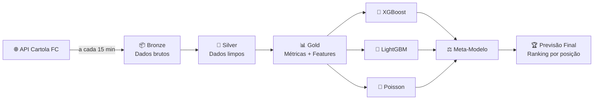

# Cartola FC Analytics — Explicação para Todos

> Este documento explica o projeto em linguagem simples, sem código ou termos técnicos. Qualquer pessoa pode entender.

---

## 1. O que é esse projeto?

O **Cartola FC** é o maior jogo de fantasy do Brasil — você monta um time com jogadores reais do Brasileirão e ganha pontos de acordo com o desempenho deles nas partidas de verdade. Cada semana há uma rodada, e o desafio é descobrir **quais jogadores vão se destacar** antes do jogo acontecer.

**O problema:** com mais de 700 atletas disponíveis, escolher os melhores é difícil. Depende de muitos fatores: o jogador está em boa fase? O adversário é fraco ou forte? O time vai jogar em casa?

**A solução:** este projeto coleta automaticamente os dados do Cartola FC, organiza tudo em camadas, e usa **modelos matemáticos** para prever a pontuação de cada atleta na próxima rodada — ajudando você a montar o melhor time possível.

---

## 2. De onde vêm os dados?

O Cartola FC disponibiliza informações em tempo real na internet — é como um **placar eletrônico gigante** que atualiza automaticamente.

Este sistema consulta esse placar a cada **15 minutos**, coletando:

| O que coletamos | Para que serve |
|----------------|---------------|
| Lista dos 740+ atletas com preços | Saber quem está disponível e quanto custa |
| Pontuação de cada atleta na rodada | Medir o desempenho real |
| Partidas da rodada (data, local, placar) | Entender o contexto de cada jogo |
| Situação do mercado (aberto/fechado) | Saber quando as escalações estão sendo feitas |
| Classificação e resultados dos clubes | Avaliar a força de cada time |

Todo esse dado é guardado automaticamente, como um **arquivo histórico** que cresce a cada rodada.

---

## 3. O que fazemos com os dados?

Os dados passam por **3 etapas de organização**, como uma linha de produção:

```
📥 COLETA          🧹 LIMPEZA          📊 ANÁLISE
(Bronze)    →      (Silver)    →       (Gold)

Dados brutos    Dados organizados    Informações úteis
como chegam     e conferidos         para decisão
```

### Etapa 1 — Coleta (Bronze)
Guardamos tudo exatamente como veio da internet, sem alterar nada. É como tirar uma foto de cada momento.

### Etapa 2 — Limpeza (Silver)
Organizamos os dados como uma planilha bem feita: cada atleta em sua linha, cada estatística em sua coluna, tudo verificado e sem erros. Por exemplo, as estatísticas de jogo que chegam em formato comprimido são transformadas em colunas legíveis:

> `{"G":1, "A":2, "CA":1}` → Gol: 1 | Assistências: 2 | Cartão Amarelo: 1

### Etapa 3 — Análise (Gold)
Com os dados limpos, calculamos **métricas úteis** para cada atleta:
- Média de pontos na temporada
- Tendência das últimas 5 rodadas (subindo, estável ou caindo)
- Score de consistência (o quanto ele pontua regularmente)
- Custo-benefício (pontos por cartoleta investida)

---

## 4. Como o sistema prevê pontuações?

Imagine que você quer saber se um atacante vai fazer gol no próximo jogo. Para isso, você consultaria **3 especialistas** com abordagens diferentes:

```
                    ┌─────────────┐
                    │  DADOS DO   │
                    │  CARTOLA FC │
                    └──────┬──────┘
                           │
         ┌─────────────────┼─────────────────┐
         ▼                 ▼                 ▼
   ┌───────────┐     ┌───────────┐     ┌───────────┐
   │Especialista│    │Especialista│    │Especialista│
   │    #1      │    │    #2      │    │    #3      │
   │  XGBoost   │    │  LightGBM  │    │  Poisson   │
   │            │    │            │    │            │
   │Aprende com │    │Foca nas    │    │Trata como  │
   │padrões de  │    │diferenças  │    │probabili-  │
   │todos dados │    │sutis entre │    │dade e dá   │
   │históricos  │    │atletas     │    │um intervalo│
   └─────┬─────┘    └─────┬─────┘    └─────┬─────┘
         └─────────────────┼─────────────────┘
                           ▼
                   ┌───────────────┐
                   │   ÁRBITRO     │
                   │ (Meta-modelo) │
                   │               │
                   │ Avalia quem   │
                   │ acertou mais  │
                   │ nas 3 últimas │
                   │ rodadas e     │
                   │ decide        │
                   └───────┬───────┘
                           ▼
                   ┌───────────────┐
                   │  PREVISÃO     │
                   │    FINAL      │
                   └───────────────┘
```

**Os 3 especialistas** são algoritmos matemáticos que aprenderam com os dados históricos de todas as rodadas anteriores. Cada um tem uma forma diferente de analisar os dados.

**O árbitro** (meta-modelo) monitora qual especialista acertou mais nas últimas 3 rodadas. Se um especialista estiver em boa fase, o árbitro confia mais nele. Se todos errarem parecido, o árbitro faz uma média ponderada dos três.

---

## 5. Como saber quem escalar?

Ao final de cada ciclo de 15 minutos, o sistema gera uma **lista ranqueada** de atletas por posição, com:

| Informação | O que significa |
|-----------|----------------|
| **Pontuação prevista** | Quantos pontos o atleta deve fazer |
| **Ranking na posição** | 1º, 2º, 3º melhor Goleiro / Lateral / etc. |
| **Custo-benefício** | Pontos esperados dividido pelo preço em cartoletas |
| **Modelo escolhido** | Qual dos 3 especialistas fez a previsão |

**Exemplo de saída:**

| # | Atleta | Posição | Clube | Previsão | Preço | Pontos/C$ |
|---|--------|---------|-------|----------|-------|-----------|
| 1 | Hulk | ATA | Atlético-MG | 8.2 pts | C$12.50 | 0.66 |
| 2 | Pedro | ATA | Flamengo | 7.9 pts | C$14.00 | 0.56 |
| 3 | Yuri Alberto | ATA | Corinthians | 6.8 pts | C$9.80 | 0.69 |

O atleta com o melhor custo-benefício não é sempre o mais caro — às vezes um jogador mais barato entrega proporcionalmente mais pontos.

---

## 6. Fluxo completo do sistema



---

## 7. Glossário — Os 10 termos que você precisa conhecer

| Termo | Explicação simples |
|-------|-------------------|
| **Rodada** | Uma semana de jogos no Brasileirão. Há 38 no total. |
| **Scout** | As estatísticas individuais de cada atleta em um jogo (gols, assistências, faltas, etc.) |
| **Cartoleta** | A moeda virtual do Cartola FC. Você tem um orçamento para montar seu time. |
| **Bronze / Silver / Gold** | Os 3 níveis de organização dos dados: bruto → limpo → analisado |
| **Feature** | Uma informação específica usada pelos modelos para fazer previsões (ex: média das últimas 5 rodadas) |
| **Modelo de ML** | Um programa que aprendeu com dados históricos a fazer previsões matemáticas |
| **Coverage Score** | A porcentagem de vezes que o modelo acertou dentro de uma margem de erro aceitável |
| **Meta-modelo** | O "árbitro" que decide qual especialista confiar mais a cada rodada |
| **Delta Table** | O formato de armazenamento dos dados — como uma planilha super-eficiente que guarda o histórico de mudanças |
| **Databricks** | A plataforma em nuvem onde tudo roda — como um computador gigante na internet |

---

## Resumo em uma frase

> Este projeto coleta automaticamente os dados do Cartola FC a cada 15 minutos, organiza tudo em 3 camadas, treina 3 modelos matemáticos com os dados históricos, e produz um ranking de quais atletas têm maior chance de pontuar bem na próxima rodada.

---

*Projeto desenvolvido com Databricks, dbt e Python. Temporada 2026.*
